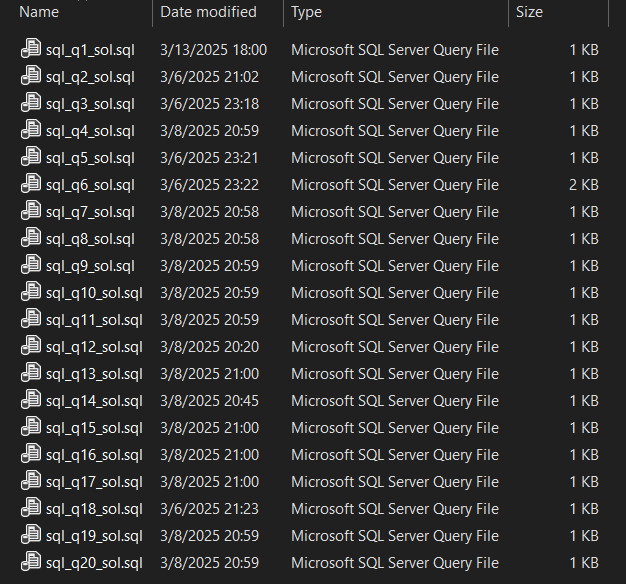

# Advanced MySQLQuery Tuning Mini Project

## 📖 Abstract
This project applies advanced SQL querying to the UEFA Euro Cup 2016 dataset, which contains detail about teams, players, referees, venues, goals, bookings, substitutions, and match outcomes. The objective was to practice SQL pattern recognition and aggregation by answering a set of 20 analytical questions about tournament play.

Tasks included:

- Writing queries to extract key match facts (start date, matches ending in penalty shootouts, stoppage time conditions).
- Building aggregations such as substitution counts by stage, goals scored by position, and bookings by referee.
- Performing joins across multiple tables (for example, match_mast, player_mast, goal_details) to link players, clubs, and match events.
- Identifying top referees by bookings and matches officiated, and venues where critical events occurred.
- Producing player-specific reports, such as Liverpool F.C. players representing England or Germany's group-stage goalkeepers.

Each query was written as a standalone .sql script, following naming conventions (sql_q<num>_sol.sql). The project reinforced advanced SQL concepts such as multi-table joins, filtering, grouping, and set-based logic, while also providing domain insights into tournament dynamics and player performance.

## 🛠 Requirements
- MySQL Server (local or remote)
- MySQL Workbench or command line client
- Euro Cup 2016 dataset (CSV files from provided ZIP archive)
- Database schema created as euro_cup_2016
- Tables imported with names matching CSV filenames

## 🧰 Setup
- Download ZIP archive containing Euro Cup 2016 CSVs
- Create schema: CREATE SCHEMA euro_cup_2016;
- Import each CSV into MySQL, naming tables after filenames
- Verify imports by querying row counts in each table

## 📊 Dataset
- Euro Cup 2016 CSVs (matches, players, bookings, goals, referees, etc.)
- Schema documented in supplied ER diagram
- Tables include Matches, Goals, Bookings, Players, Teams, Referees, Substitutions

## ⏱️ Run Steps
- Import dataset into MySQL schema euro_cup_2016
- Open each SQL file (sql_q<question number>_sol.sql)
- Run queries in MySQL Workbench or CLI
- Verify results match expectations for each of 20 rubric questions

## 📈 Outputs
- 20 SQL query outputs answering rubric questions
- Results include match metadata, bookings, substitutions, referees, players, and goals

## 📸 Evidence

  
Screenshot of 20 SQL Scripts

## 📎 Deliverables

- [`sql_q10_sol.sql`](./deliverables/sql_q10_sol.sql)

- [`sql_q11_sol.sql`](./deliverables/sql_q11_sol.sql)

- [`sql_q12_sol.sql`](./deliverables/sql_q12_sol.sql)

- [`sql_q13_sol.sql`](./deliverables/sql_q13_sol.sql)

- [`sql_q14_sol.sql`](./deliverables/sql_q14_sol.sql)

- [`sql_q15_sol.sql`](./deliverables/sql_q15_sol.sql)

- [`sql_q16_sol.sql`](./deliverables/sql_q16_sol.sql)

- [`sql_q17_sol.sql`](./deliverables/sql_q17_sol.sql)

- [`sql_q18_sol.sql`](./deliverables/sql_q18_sol.sql)

- [`sql_q19_sol.sql`](./deliverables/sql_q19_sol.sql)

- [`sql_q1_sol.sql`](./deliverables/sql_q1_sol.sql)

- [`sql_q20_sol.sql`](./deliverables/sql_q20_sol.sql)

- [`sql_q2_sol.sql`](./deliverables/sql_q2_sol.sql)

- [`sql_q3_sol.sql`](./deliverables/sql_q3_sol.sql)

- [`sql_q4_sol.sql`](./deliverables/sql_q4_sol.sql)

- [`sql_q5_sol.sql`](./deliverables/sql_q5_sol.sql)

- [`sql_q6_sol.sql`](./deliverables/sql_q6_sol.sql)

- [`sql_q7_sol.sql`](./deliverables/sql_q7_sol.sql)

- [`sql_q8_sol.sql`](./deliverables/sql_q8_sol.sql)

- [`sql_q9_sol.sql`](./deliverables/sql_q9_sol.sql)

## 🛠️ Architecture
- Single-node MySQL database
- Schema euro_cup_2016 with imported CSV tables
- Pure SQL analytical queries across relational joins

## 🔍 Monitoring
- Manual validation of query correctness by reviewing result sets
- Cross-check with rubric questions to ensure logical match

## ♻️ Cleanup
- Drop schema euro_cup_2016 if no longer needed
- Delete downloaded Euro Cup CSV ZIP archive
- Remove SQL solution scripts if storing only in GitHub

*Generated automatically via Python + Jinja2 + SQL Server table `tblMiniProjectProgress` on 09-16-2025 12:32:19*